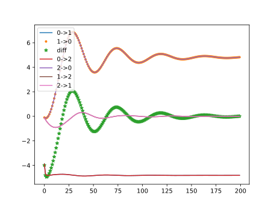
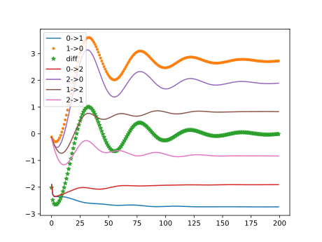
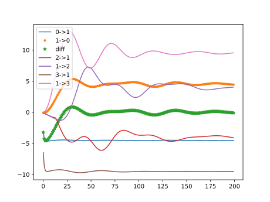
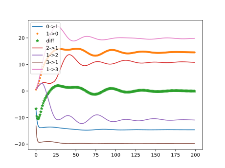

使用Gasualdo Scutari Francisco Facchinei《Real and Complex Monotone Communication Games》的算法(即N+1player)，计算出了变分均衡的值。

源代码如链接🔗所示：

https://github.com/MrDotJ/repetition-paper/tree/master/source/variational_equilibrium

测试系统及结果📊：(绿线表明收敛曲线)

1. 简单的2节点系统

   ```
   #   o------o
   #   0      1
   ```

   ```
   player1_info = {
       'index': 0,
       'demand_ref': 15,  # 基准负荷
       'supply_max': 5,   # 最大生产功率
       'demand_max': 25,  #最大负荷  下同
   }
   player2_info = {
       'index': 1,
       'demand_ref': 20,
       'supply_max': 45,
       'demand_max': 30,
   }
   ```

   目标函数:
   $$
   f_{i}(x) = P_{cost} + P_{utility} + P_{exchange}
   $$

   $$
   P_{cost}(x_{power}) = a*x_{power}^{2} + b*x_{power}
   $$

   $$
   P_{utility}(x_{demand}) = (x_{demand} - x_{reference})^{2}
   $$

   $$
   P_{exchange} = \sum_{j\in\Omega_i}price_{ij} * x_{j}
   $$

   $$
   x_{ij}+x_{ji} =0 \quad\quad  \forall {(i,j)\in T}
   $$

   

   系统的收敛曲线如图所示：

   

2. 三节点系统

   其系统全连接，具体配置如下

   ```
   #   1   2           
   #   o---o
   #    \ /  
   #     o
   #     0  
   ```

   ```
   player1_info = {
       'index': 0,
       'demand_ref': 20,
       'supply_max': 10,
       'demand_max': 30,
   }
   player2_info = {
       'index': 1,
       'demand_ref': 20,
       'supply_max': 30,
       'demand_max': 25,
   }
   player3_info = {
       'index': 2,
       'demand_ref': 20,
       'supply_max': 30,
       'demand_max': 25,
   }
   ```

   该系统三节点互联，系统得到的收敛曲线如图

   

   其中2，3节点配置完全相同，所以曲线有重合☝

   改变不同节点的价格成本情况，

   ```
   player2_info = {
       'supply_a': 2.5,
       'supply_b': 0.1,
       'demand_a': 10,
   }
   player3_info = {
       supply_a': 3,
       'supply_b': 0.1,
       'demand_a': 10,
   }
   ```

   得到的新的均衡如下：

   

3. 五节点系统

   五节点系统拓扑如图：

   ```
   #    0     1      2
   #    o-----o------o
   #          |      |
   #          o      o
   #          3      4
   ```

   系统配置如源代码所示📜

   计算结果如图(由于结果较多，图片仅展示1<-->0, 1<-->2, 1<-->3的结果):

   

   

4. 综合能源(气/热/无储能)五节点系统

   主要参考了老师的文章《A Generalized Nash Equilibrium Approach for Autonomous Energy Management of Residential Energy Hubs》👈对于Energy Hub的建模，其中包括gas--gas turbine, gas--gas furnace, 但是忽略了与公网的连接，仅保留区域间的互联，并且忽略了所有的储能装置

   拓扑采用的是相同的五节点
   $$
   f_{i}(x) = P_{cost} + P_{utility} + P_{exchange}
   $$

   $$
   P_{cost} = \lambda_{gas} * M_{gas}
   \\
   Turbine + Furance = M_{gas}
   $$

   $$
   P_{utility} = \alpha(Power_{demand} - Power_{refer})^{2} + \beta(Heat_{demand} - Heat_{refer})^{2}
   $$

   $$
   Power_{demand} = Turbine * \eta_{1} + Power_{exchange}
   $$

   $$
   Heat_{demand} = Turbine*\eta_{2} + Furnace
   $$

   $$
   P_{exchange} = \sum_{j\in\Omega_i}\lambda_{ij} * x_{j}
   $$

   $$
   x_{ij}+x_{ji} =0 \quad\quad  \forall {(i,j)\in T}
   $$

   

   系统的具体配置如源代码所示:

   ```
   player1_info = {
       'index': 0,
       'power_demand_ref': 20,   # 功率参考值
       'power_demand_max': 30,   # 功率最大值
       'heat_ref': 15,			  # 热负荷参考值
       'heat_min': 10,           # 热负荷最小值
       'heat_max': 20,           # 热负荷最大值
   
       'heat_a': 10,			  # 热负荷舒适系数
       'demand_a': 10,           # 电负荷舒适系数
   
       'gas_in_max': 20,		  # 耗气最大容量
   
       'exchange_max': 50,       # 最大交换功率
       'connection': [1],		  # 连接
       'gas_price': 2.5,		  # 气价
       'coeff_gas_turbine_to_elec': 0.8,		# turbine的气-电转换系数
       'coeff_gas_turbine_to_heat': 0.2,       # turbine的气-热转换系数
       'coeff_gas_furnace': 1    # furnace的效率
   }
   ```

   计算结果如图(由于结果较多，图片仅展示1<-->0, 1<-->2, 1<-->3的结果):

   

5. 一个有趣的现象是，对于情况2(三节点)中最终结果，施加函数：

   Price = Constant - Coefficient * (Power_real - Power_reference)， 即

   ```
   new_price = old_price - 0.1 * (demand_value - self.demand_ref)
                                #    优化结果         参考值
   ```

   发现结果基本相同

   ```
   #[[[0, 5.3261481100402515, 5.3261481100402515],
   #  [5.325721551707392, 0, 5.325721551707392],
   #  [5.325721551707392, 5.325721551707392, 0]],
   ```

    感觉可能是配置相同导致的，也可能是隐含了变分均衡的物理意义，需要进一步的观察🤔


